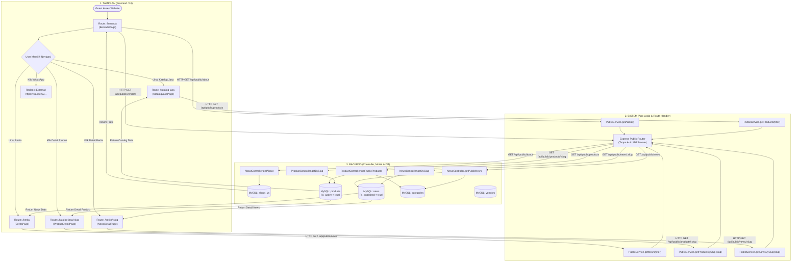
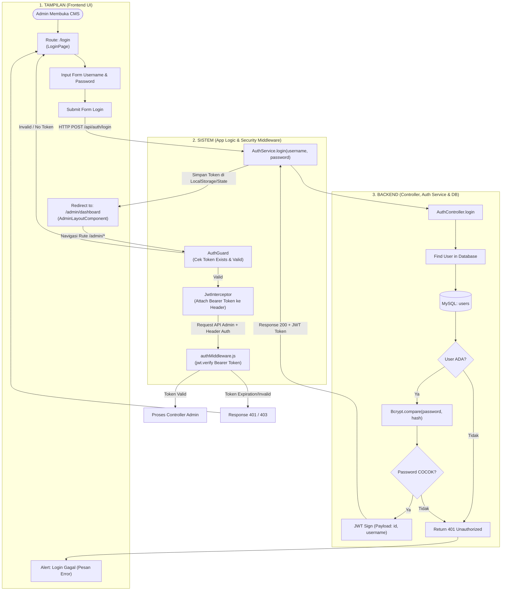

# Flowchart Sistem CMS (Public & Admin) - PT Gibran / CMS Gobana Company

Dokumen ini memvisualisasikan alur sistem CMS secara transparan dan terstruktur dengan memisahkan 3 lapisan utama:
1. **Tampilan (Frontend / UI)**: Halaman, Komponen, Router Angular/Ionic.
2. **Sistem (App Logic / Middleware)**: State, Interceptor, Guard, Express Router, dan Middleware.
3. **Backend (Controller, Model & Storage)**: Express Controller, Sequelize ORM, Database MySQL (`db_pt_gibran`), serta Storage Uploads.

---

## 1. Flowchart Rute User Public (Guest)

Visualisasi alur pengguna publik yang mengakses profil perusahaan, berita, katalog produk/jasa, dan kontak WhatsApp.

---

## 2. Flowchart Autentikasi & Proteksi Admin

Visualisasi alur login, penerbitan JWT token, proteksi rute Angular `AuthGuard`, dan verifikasi header `Authorization: Bearer <token>` oleh `authMiddleware`.

---

## 3. Flowchart Rute Admin & Pengelolaan CMS (Dashboard & CRUD)

Visualisasi alur Admin saat mengelola Dashboard, Kategori, Produk/Jasa, Berita, Vendor, dan Profil Perusahaan beserta handler Upload File Gambar (Multer).

```mermaid
flowchart TD
    subgraph UI["1. TAMPILAN (Frontend UI Admin)"]
        D1["Route: /admin/dashboard\n(DashboardPage)"]
        D2["Route: /admin/kategori-jasa\n(KategoriJasaPage)"]
        D3["Route: /admin/jasa\n(JasaPage - CRUD Produk/Jasa)"]
        D4["Route: /admin/berita\n(BeritaPage - CRUD Berita)"]
        D5["Route: /admin/vendor\n(VendorPage - CRUD Vendor)"]
        D6["Route: /admin/tentang-kami\n(TentangKamiPage - Profil)"]
        D7["Modal Form (Tambah / Edit Data)"]
        D8["Upload Input (<input type='file'>)"]
        D9["Tombol Logout"]
    end

    subgraph SYS["2. SISTEM (App Logic & Middleware)"]
        S_HTTP["HttpClient + JwtInterceptor\n(Authorization: Bearer JWT)"]
        S_GUARD["authMiddleware.js\n(Verifikasi JWT Token)"]
        S_MULTER["Multer Upload Middleware\n- Validasi Extension (.png, .jpg, .jpeg)\n- Validasi File Size (Max 2MB)"]
        S_VAL["Validation Logic\n(Required Fields, Slugify)"]
    end

    subgraph BE["3. BACKEND (Controller, File Storage & Database)"]
        C_DASH["DashboardController.getStats"]
        C_CAT["CategoryController (CRUD)"]
        C_PROD["ProductController (CRUD)"]
        C_NEWS["NewsController (CRUD)"]
        C_VEN["VendorController (CRUD)"]
        C_ABOUT["AboutController.update"]

        STOR["Physical File Storage\n(/storage/uploads)"]
        FS_UNLINK["fs.unlink()\n(Hapus gambar saat Delete record)"]

        DB_ALL[("MySQL Database db_pt_gibran\n(categories, products, news, vendors, about_us)")]
    end

    %% UI to System
    D1 -->|GET /api/admin/dashboard/stats| S_HTTP
    D2 -->|GET/POST/PUT/DELETE /api/admin/categories| S_HTTP
    D3 -->|Multipart Form POST/PUT /api/admin/products| S_HTTP
    D4 -->|Multipart Form POST/PUT /api/admin/news| S_HTTP
    D5 -->|Multipart Form POST/PUT /api/admin/vendors| S_HTTP
    D6 -->|PUT /api/admin/about| S_HTTP
    D9 -->|Clear JWT Storage| LOGIN["Redirect /login"]

    %% System to Backend
    S_HTTP --> S_GUARD
    S_GUARD --> S_VAL

    D3 & D4 & D5 -->|File Image Included| S_MULTER
    S_MULTER -->|Save File Physical| STOR
    S_MULTER -->|Pass File Path| S_VAL

    S_VAL -->|Stats Req| C_DASH
    S_VAL -->|Category Req| C_CAT
    S_VAL -->|Product Req| C_PROD
    S_VAL -->|News Req| C_NEWS
    S_VAL -->|Vendor Req| C_VEN
    S_VAL -->|About Req| C_ABOUT

    %% Backend to DB & Storage
    C_DASH -->|COUNT queries| DB_ALL
    C_CAT -->|INSERT/UPDATE/DELETE| DB_ALL
    C_PROD -->|INSERT/UPDATE/DELETE| DB_ALL
    C_NEWS -->|INSERT/UPDATE/DELETE| DB_ALL
    C_VEN -->|INSERT/UPDATE/DELETE| DB_ALL
    C_ABOUT -->|UPDATE about_us| DB_ALL

    C_PROD & C_NEWS & C_VEN -->|On Delete with Image| FS_UNLINK
    FS_UNLINK -->|Remove Physical File| STOR

    DB_ALL -->|Return JSON Data/Status| UI
```

---

## 4. Matriks Pemetaan Rute & Arsitektur Layer

| Modul | Rute Frontend (Tampilan) | Middleware & Logic (Sistem) | Endpoint API & Handler (Backend) | Tabel Database / Storage |
|---|---|---|---|---|
| **Public Landing** | `/beranda` | `PublicService.getAbout()` | `GET /api/public/about` | `about_us` |
| **Public Katalog** | `/katalog-jasa` | `PublicService.getProducts()` | `GET /api/public/products` | `products`, `categories` |
| **Public Detail Jasa**| `/katalog-jasa/:slug` | `PublicService.getProductBySlug()` | `GET /api/public/products/:slug` | `products` |
| **Public Berita** | `/berita` | `PublicService.getNews()` | `GET /api/public/news` | `news`, `categories` |
| **Public Detail Berita**| `/berita/:slug` | `PublicService.getNewsBySlug()` | `GET /api/public/news/:slug` | `news` |
| **Admin Login** | `/login` | `AuthService.login()` | `POST /api/auth/login` | `users` (Bcrypt + JWT) |
| **Admin Dashboard** | `/admin/dashboard` | `AuthGuard` + `JwtInterceptor` | `GET /api/admin/dashboard/stats` | `news`, `products`, `categories`, `vendors` |
| **Admin Kategori** | `/admin/kategori-jasa` | `AuthGuard` + `authMiddleware` | `GET/POST/PUT/DELETE /api/admin/categories` | `categories` |
| **Admin Jasa/Produk**| `/admin/jasa` | `authMiddleware` + `Multer` | `GET/POST/PUT/DELETE /api/admin/products` | `products`, `/storage/uploads` |
| **Admin Berita** | `/admin/berita` | `authMiddleware` + `Multer` | `GET/POST/PUT/DELETE /api/admin/news` | `news`, `/storage/uploads` |
| **Admin Vendor** | `/admin/vendor` | `authMiddleware` + `Multer` | `GET/POST/PUT/DELETE /api/admin/vendors` | `vendors`, `/storage/uploads` |
| **Admin Profil** | `/admin/tentang-kami` | `authMiddleware` | `GET/PUT /api/admin/about` | `about_us` |
